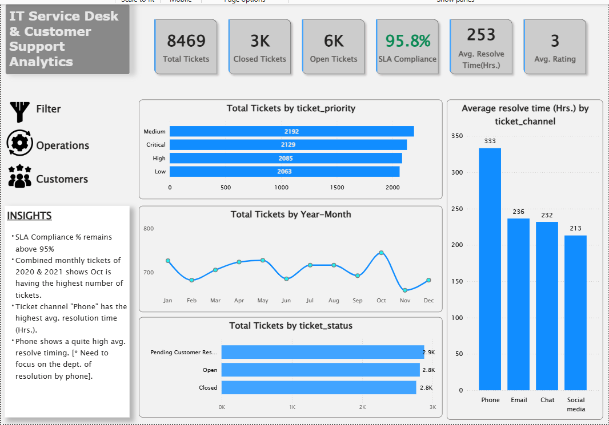
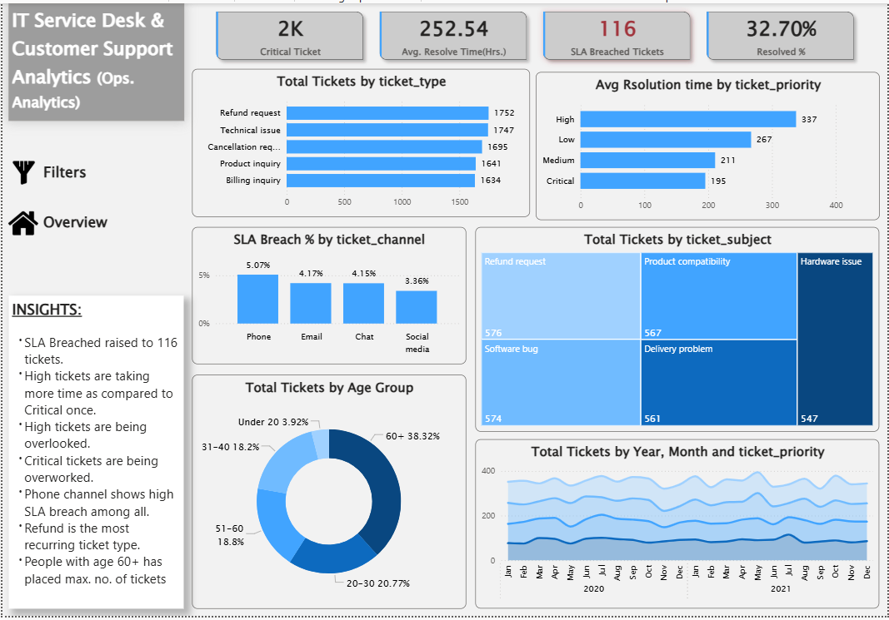
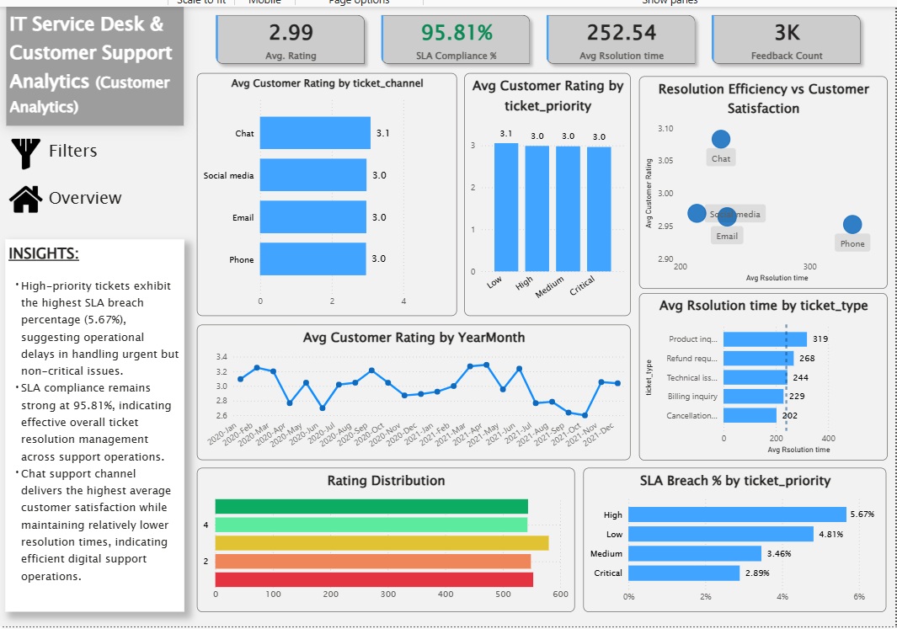

# IT Service Desk & Customer Support Analytics Dashboard

## Project Overview
This project is an end-to-end Service Desk Analytics solution built using Power BI, SQL, and Python. The dashboard analyzes IT support operations, SLA performance, ticket resolution efficiency, and customer satisfaction trends.
The goal of this project is to simulate a real-world operational analytics environment where business stakeholders can monitor support performance and identify operational bottlenecks.

---

## Tools & Technologies Used
- Power BI
- PostgreSQL
- SQL
- Python (Pandas)
- Excel / CSV

---

## Key Features

### Executive Dashboard
- Ticket volume analysis
- SLA compliance tracking
- Ticket status monitoring
- Support channel analysis

### Operational Analytics
- Ticket priority analysis
- Resolution efficiency monitoring
- SLA breach analysis
- Ticket type trend analysis
- Operational insights panel

### Customer Experience Analytics
- Customer satisfaction tracking
- Resolution time vs satisfaction analysis
- SLA analytics by priority
- Customer experience trends
- Support channel performance evaluation

---

## Data Cleaning & Transformation

Performed extensive data preprocessing including:

- Missing value handling
- Invalid timestamp correction
- Negative duration anomaly handling
- KPI derivation
- SLA metric calculation
- Custom DAX measure creation

---

## Key Business KPIs

- Total Tickets
- Closed Tickets
- SLA Compliance %
- Average Resolution Time
- Customer Satisfaction Rating
- SLA Breach %
- Ticket Volume by Priority
- Resolution Efficiency by Channel

---

## Key Insights

- SLA compliance remained above 95% across operations.
- High-priority tickets showed higher SLA breach risk than critical tickets.
- Chat support channel achieved the highest customer satisfaction.
- Product Inquiry and Refund Request tickets required the longest resolution effort.
- Customer satisfaction remained relatively stable around 3.0 across time periods.

---

## Dashboard Screenshots

### Executive Overview

---

### Operational Analytics

---

### Customer Experience & SLA Analytics

---

## Learning Outcomes

Through this project, I gained hands-on experience in:

- Business KPI development
- Power BI dashboard design
- Data storytelling
- SQL-based operational analysis
- Data cleaning and anomaly handling
- DAX calculations and dashboard interactivity
- Effective way of canvas/space utilization

---

- Real-time ticket monitoring integration

